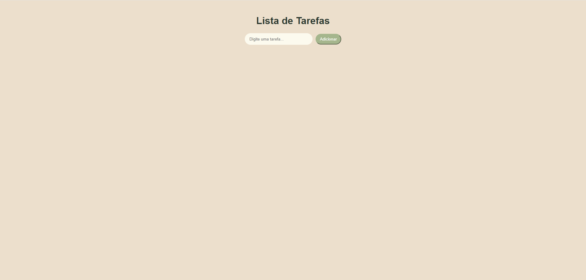
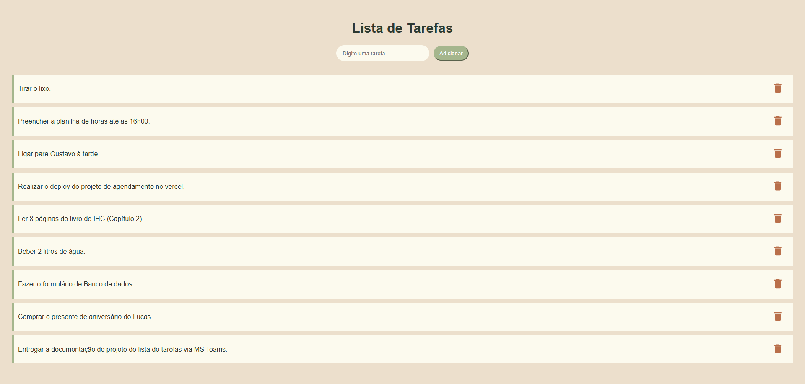
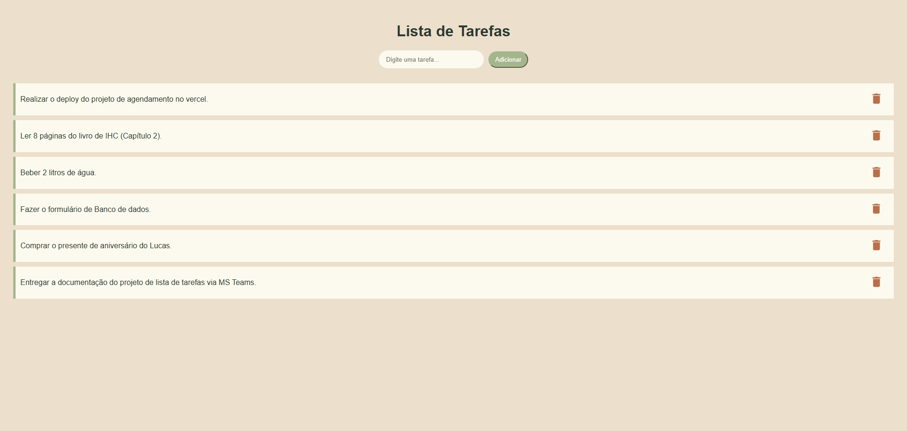

# Projeto - Lista de tarefas

Projeto simples desenvolvido em React.js que permite aos usuários adicionar e remover tarefas de uma lista.


## Funcionalidades

- Entrada de texto: um campo de entrada onde os usuários podem digitar o texto  da tarefa.
- Botão "Adicionar": um botão que, ao ser clicado, adiciona a tarefa digitada à  lista.
- Lista de tarefas: uma lista que exibe as tarefas adicionadas.
- Botão "Remover" (com ícone de lixeira): um botão ao lado de cada tarefa na lista que permite  removê-la.

## Screenshots







## Rodando localmente

Clone o projeto

```bash
  git clone https://github.com/Debora-Carvalho/projeto-lista-tarefas.git
```

Entre no diretório do projeto

```bash
  cd projeto-lista-tarefas
```

Instale as dependências

```bash
  npm install
```

Inicie o servidor

```bash
  npm run start
```

## Autora

- [@Debora-Carvalho](https://www.github.com/Debora-Carvalho)

